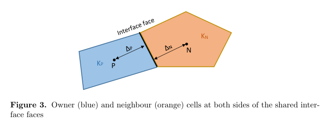
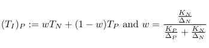
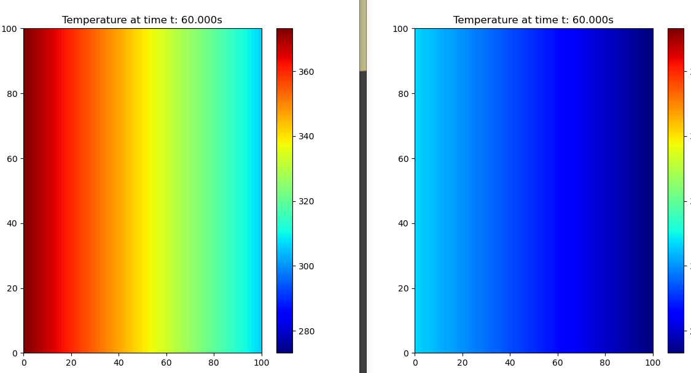
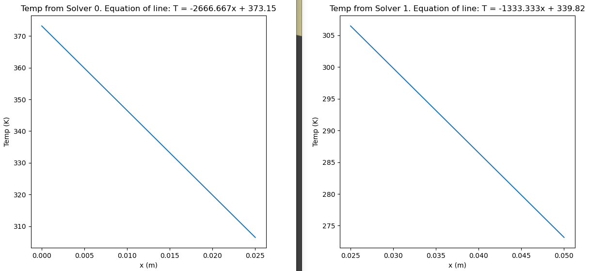

# Temperature Solver

## Usage

The code assumes that some temperature is applied evenly across the leftmost boundary and then calculates the resulting temperature gradient at equilibrium. For small values of nodes the gradient can be viewed in real time but incurs considerable slowdown (see animate parameter for Heat2d constructor). To run a simple case with default values and only 1 solver use:

```bash
python3 - m temperatureSolver.src.main
```

Note that this must be run from the parent directory. To customise use as arguments below (options section shows default values):

```bash
python3 - m temperatureSolver.src.main [-h] [--height HEIGHT] [--length LENGTH] [--thickness THICKNESS] [--alpha ALPHA] [--kappa KAPPA] [--nodes NODES]

options:
  -h, --help            show this help message and exit
  --height 1
  --length 0.025
  --thickness 0.01
  --alpha 1.27e-4
  --kappa 318
  --nodes 20
```

To run multiple solvers use mpirun as below:

```bash
# Two solvers exactly the same
mpirun -np 2 python3 - m temperatureSolver.src.main --length 0.025

#Two solvers with differing arguments
mpirun -np 1 python3 - m temperatureSolver.src.main --length 0.025 : -np 1 python3 - m temperatureSolver.src.main --length 0.05 --kappa 636 --alpha 2.55e-4
```

## Dependencies

This project uses numpy, matlplotlib, argparser, mpi4py, mui4py, and pytest. To install these dependencies use
```bash
pip install -r requirements.txt
```

## Governing Equations and Approximation

The heat equation in 2 dimensions is given by the PDE below, where $\alpha$ is the diffusivity constant of the material.

$\frac{\partial T}{\partial t} = \alpha \Delta T$ where $\Delta T = \frac{\partial^2 T}{\partial^2 x} + \frac{\partial^2 T}{\partial^2 y}$

We can solve this numerically using the Finite Difference method which relies on the approximation:

$\frac{\partial f(x)}{\partial x} \approx \frac{f(x+h)-f(x)}{h}$ for small $h$.

This comes from the first principle definition of the derivative but can also be derived from the taylor series expansion of a function. See [here](https://www.youtube.com/watch?v=ZuxAZxguv-0) or [here](https://github.com/barbagroup/CFDPython/tree/master) for a full walk through of the discretisation in time and space.

Applying the discretisation we get the following discretised expressions for the temperature gradient.

$\frac{\partial T}{\partial t} \approx \frac{1}{\Delta t}(T(t_0 + \Delta t, x_0, y_0)-T(t_0, x_0, y_0))$

$\frac{\partial^2 T}{\partial^2 x} \approx \frac{1}{\Delta x^2}(T(t_0,x_0+\Delta x, y_0) - 2T(t_0, x_0, y_0) + T(t_0, x_0 - \Delta x, y_0))$

$\frac{\partial^2 T}{\partial^2 y} \approx \frac{1}{\Delta y^2}(T(t_0,x_0, y_0+\Delta y) - 2T(t_0,x_0, y_0) + T(t_0, x_0, y_0 - \Delta y))$

Where $\Delta t$, $\Delta x$ and $\Delta y$ are user defined parameters. From a CFD perspective you can view $\Delta x$ and $\Delta y$ as the mesh resolution and $\Delta t$ as the simulation timestep. Using smaller values of these parameters generally improves accuracy. However these must be set in tandem with each other, see [Courant number](https://en.wikipedia.org/wiki/Courant%E2%80%93Friedrichs%E2%80%93Lewy_condition).

Subbing in our approximations to the heat equation we get:

$\frac{1}{\Delta t}(T(t_0 + \Delta t, x_0, y_0)-T(t_0, x_0, y_0)) = \alpha(\frac{1}{\Delta x^2}(T(t_0,x_0+\Delta x, y_0) - 2T(t_0, x_0, y_0) + T(t_0, x_0 - \Delta x, y_0)) + \frac{1}{\Delta y^2}(T(t_0,x_0, y_0+\Delta x) - 2T(t_0, x_0, y_0) + T(t_0, x_0, y_0 - \Delta y)))$

Rearranging:

$T(t_0 + \Delta t, x_0, y_0) = T(t_0, x_0, y_0) + \alpha (\frac{\Delta t}{\Delta x^2}(T(t_0,x_0+\Delta x, y_0) - 2T(t_0, x_0, y_0) + T(t_0, x_0 - \Delta x, y_0)) + \frac{\Delta t}{\Delta y^2}(T(t_0,x_0, y_0+\Delta x) - 2T(t_0, x_0, y_0) + T(t_0, x_0, y_0 - \Delta y)))$

Let $T^n_{i, j} = T(t_0, x_0, y_0)$ i.e Temperature at current time and location, then:

$T_{i, j}^{n+1} = T^n_{i, j} + \alpha \frac{\Delta t}{\Delta x^2}(T^n_{i+1, j} -2T^n_{i, j}+T^n_{i-1,j}) + \alpha \frac{\Delta t}{\Delta y^2}(T^n_{i, j+1} -2T^n_{i, j}+T^n_{i,j-1})$

This is an expression for the temperature at the next timestep in terms of entirely known variables. We can compute this iteratively to solve for temperature at a given time (given we know some inital state).

## Coupling

This project uses [MUI](https://github.com/MxUI/MUI) to couple multiple solvers together. There are two possible coupling conditions that can be enforced with similar performance.

Let $P$ be the owner cell and $N$ be the neigbouring cell. The respective temperatures in the cell centres are $T_P$ and $T_N$. They share an interface with temperature $T_I$.

<p align="center">
  
</p>

### Linear Interpolation

This is the simplest interface condition, we enforce the same Dirichlet boundary condition on both sides of the interface. Namely:
<p align="center">
  
</p>

This is a weighted average of $T_P$ and $T_N$ based on Thermal Conductivty $K$ and distance to the interface $\Delta$. This is implemented in OpenFOAM by extending the [mixed patch type](https://www.openfoam.com/documentation/guides/latest/doc/guide-bcs-mixed.html) and is used in many coupled solvers such as chtMultiRegionFoam. More information on this interface condition can be found [in this paper](https://journal.openfoam.com/index.php/ofj/article/view/92/156) and on Page 44 of [Numerical Heat Transfer and Fluid Flow](https://catatanstudi.wordpress.com/wp-content/uploads/2010/02/numerical-heat-transfer-and-fluid-flow.pdf) by Suhas Patankar.

### Neumann-Dirichlet

Here we impose a Dirichlet Condition (fixedValue) on one side and Neumann Condition (fixedGradient) on the other. Supposing $P$ was the side imposing the Neumann Condition we would have:

<p align="center">
  
</p>

Here the superscript denotes the iteration number the given temperature is from.

Each side decides which kind of condition it will impose based on the convergenceCoefficient variable. If the the Neumann side has a convergenceCoefficient greater than 1 we will get blow up since we recursively multiply by the convergenceCoefficient. Since one side must have a convergenceCoefficient smaller than 1 we always set this side to impose the Neumann Condition.

## Validation and Testing

The validation cases are based on this [site](https://www.fifty2.eu/innovation/conduction-through-a-composite-wall/). Testing is implemented with Pytest and can be run using:

```bash
# set X to the number of solvers you wish to test with
mpirun -np X pytest tests.py
```

### Example Case - 2 Layers 2 Materials

To run use:
```bash
mpirun -np 1 python3 -m temperatureSolver.src.main --length 0.025 --nodes 100 : -np 1 python3 -m temperatureSolver.src.main --length 0.025 --alpha 2.5e-4 --kappa 636 --nodes 100
```

#### Parameters

- Layer length $x_1 = 0.025$ m, $x_2 = 0.025$ m
- Layer height: 1m (this is irrelevant in practice since flux at the top and bottom is always 0)
- Inital Temperature $T_1 = 373.15$
- Final Temperature $T_3 = 273.15$
- Thermal diffusivity $\alpha_1 = 1.27 \times 10^{-4} $ ([Pure Gold](https://www.engineersedge.com/heat_transfer/thermal_diffusivity_table_13953.htm)) $\alpha_2 = 2\alpha_1 = 2.54 \times 10^{-4}$
- Thermal conductivity $k_1 = 318 $, $k_2 = 2k_1 = 636$
- Simulation time: 20s
- number of nodes: 20,000 (100x100x2)

#### Results






##### Comments

Theoretically, the gradients should be:

$\frac{DT}{dx} = -Q/k$

We have:

$Q = \frac{T_1-T_3}{\frac{x_1}{k_1 A} + \frac{x_2}{k_2 A} } = \frac{100}{\frac{x_1}{k_1}+\frac{x_1}{2k_1}} = \frac{200k_1}{3x_1} = 848,000 \frac{W}{m^2}$

Thus we expect a gradients of $\frac{-848000}{318} = 2666.66666...$ and $\frac{-848000}{636} = 1333.33333...$

Furthermore, the measure value of $T_2$ at the interface is 348.3333... as expected.